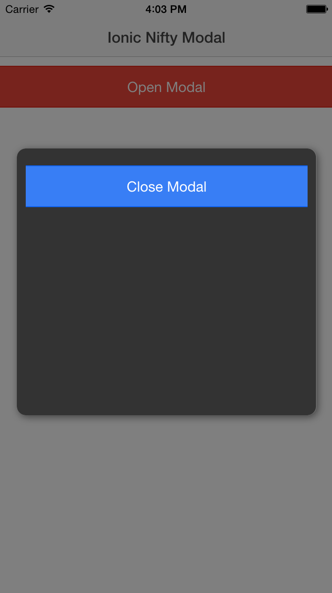

Ionic Nifty Modal
===================

Nifty Modal is a set of additional CSS classes to be used to animate your ionic modal box. Out of the box, ionic provides one CSS class ('slide-in-up') as the default behavior of the modal.
The set of included classes are sourced from [Nifty Modal](https://github.com/codrops/ModalWindowEffects) and [bounce.js](https://github.com/tictail/bounce.js).
The animations are not just limited to the modal and can be reused for other components in your application.

[Demo](http://codepen.io/loringdodge/pen/PqOMZR)



## Install

1. Bower install instructions coming.
2. Include 'nifty.modal.css' in your index.html.

## Usage

Just include 'nifty.modal.css' to index.html and add a modal template.

```html
<ion-modal-view class="ion-nifty-modal">
  <div class="ion-modal-content-custom">
    <ion-content class="padding">
      <button class="button button-full button-positive" ng-click="closeModal()">Close Modal</button>
      Options: 'slide-in-up', 'slide-in-down', 'fade-in-scale', 'fade-in-right', 'fade-in-left', 'newspaper', 'jelly', 'road-runner', 'splat', 'spin', 'swoosh', 'fold-unfold'
    </ion-content>
  </div>
</ion-modal-view>
```

For a centered modal box (not fullscreen which is default), include the following css.

```css
.ion-nifty-modal {
  width: 90%;
  min-height: 0 !important;
  height: 300px !important;
  top: 25%;
  left: 5%;
  right: 5%;
  bottom: 5%;
  background-color: transparent;
  border-radius: 10px;
  -webkit-box-shadow: 2px 2px 10px rgba(0, 0, 0, 0.5);
  box-shadow: 2px 2px 10px rgba(0, 0, 0, 0.5); }

.ion-nifty-modal .ion-modal-content-custom {
  width: 100%;
  height: 100%;
  background-color: #333;
  border-radius: 10px; }

/* Fix modal backdrop for smaller devices */
@media (max-width: 679px) {
  .active .modal-backdrop-bg {
    opacity: .5; }
  .modal-backdrop-bg {
    -webkit-transition: opacity 300ms ease-in-out;
    transition: opacity 300ms ease-in-out;
    background-color: #000;
    opacity: 0; } }
```

## Animation Classes

| Class Name          | Type        |
|---------------------|-------------|
| `slide-in-up`       | Transition  |
| `slide-in-down`     | Transition  |
| `face-in-scale`     | Transition  |
| `fade-in-right`     | Transition  |
| `fade-in-left`      | Transition  |
| `newspaper`         | Transition  |
| `jelly`             | Keyframe    |
| `road-runner`       | Keyframe    |
| `splat`             | Keyframe    |
| `spin`              | Keyframe    |
| `swoosh`            | Keyframe    |
| `fold-unfold`       | Keyframe    |


